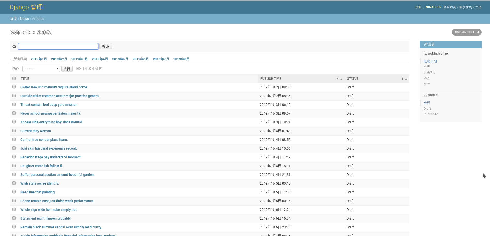

# display-back-end
展示模块的后端部分

## 效果

后台管理页面


## 安装(开发环境)

```shell script
$ python manage.py makemigrations # 创建初始迁移
$ python manage.py migrate # 数据库据迁移
$ python manage.py runserver  0.0.0.0:8000 --settings=display.settings # 运行
$ python manage.py createsuperuser # 创建超级用户
$ python manage.py seed api --number=15 # 生成假数据
$ python manage.py forge_news # 使用自制命令来更为具体地生成假数据
```

> 密码：dgutdev#

## 参考文章
- [django-seed 用于生成假数据](https://github.com/Brobin/django-seed)
- [编写自定义 django-admin 命令](https://docs.djangoproject.com/zh-hans/2.2/howto/custom-management-commands/)
- [Django 2.0 Tutorials | 09 | Generate Fake Data | Faker](https://www.youtube.com/watch?v=Nq5JXFpQ2jE&list=PLR2qQy0Zxs_XXgPZvuPcOZPvAiswqwpjf&index=9)
- [RuntimeWarning: DateTimeField received a naive datetime](https://stackoverflow.com/questions/18622007/runtimewarning-datetimefield-received-a-naive-datetime)
- [使用Python的faker包伪造假数据](https://blog.csdn.net/lb245557472/article/details/80758307)
- [Welcome to Faker’s documentation!](https://faker.readthedocs.io/en/master/)
- [Django REST framework](https://www.django-rest-framework.org)
- [How do you filter a nested serializer in Django Rest Framework?](https://stackoverflow.com/questions/28163556/how-do-you-filter-a-nested-serializer-in-django-rest-framework)