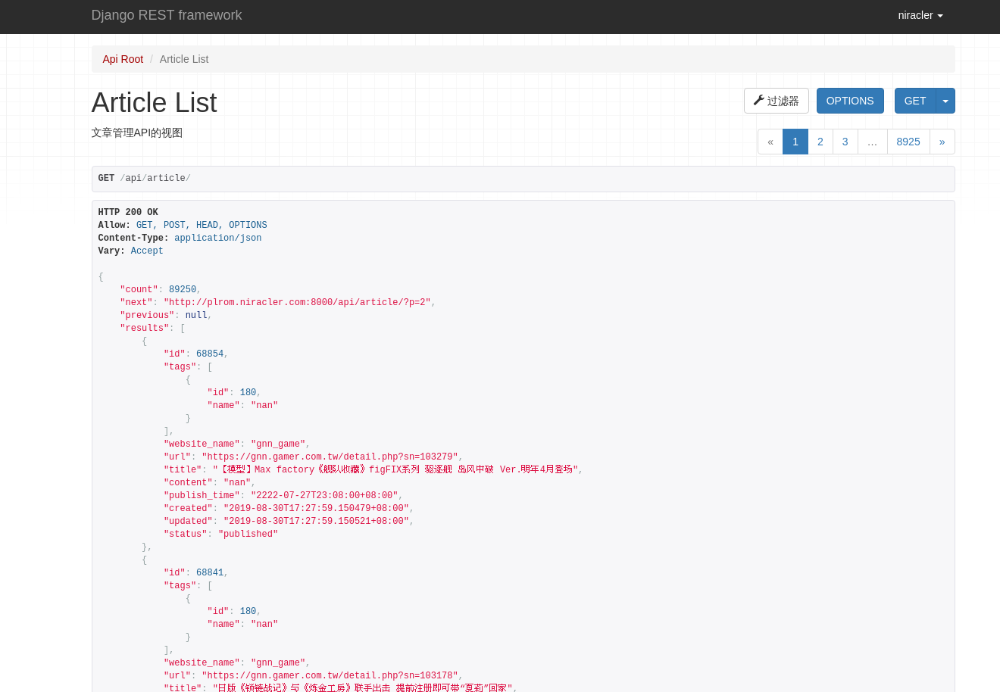

# display-back-end
展示模块的后端部分

## 效果

后台管理页面


API接口


## 安装(开发环境,测试用)

这里只是写个大致的，依赖什么的肯定是要先安装的吧？这种方法还是很坑的,因为不同地方的环境都极其不一样,推荐使用docker

```shell script
$ git clone https://github.com/ghost-of-fantasy/display-back-end.git gamenewsb # git 克隆仓库
$ cd gamenewsb # 进入项目目录
$ pip3 install -r requirements.txt -i https://pypi.tuna.tsinghua.edu.cn/simple
$ python3 manage.py makemigrations # 创建初始迁移
$ python3 manage.py migrate # 数据库据迁移
$ python3 manage.py runserver  0.0.0.0:8000 --settings=display.settings # 运行
$ python3 manage.py createsuperuser # 创建超级用户
```

## 安装(生产环境)


```shell script
$ docker-compose build # 构建镜像
$ docker-compose up -d # 启动
```

> 密码：dgutdev#

## 参考文章
- [django-seed 用于生成假数据](https://github.com/Brobin/django-seed)
- [编写自定义 django-admin 命令](https://docs.djangoproject.com/zh-hans/2.2/howto/custom-management-commands/)
- [Django 2.0 Tutorials | 09 | Generate Fake Data | Faker](https://www.youtube.com/watch?v=Nq5JXFpQ2jE&list=PLR2qQy0Zxs_XXgPZvuPcOZPvAiswqwpjf&index=9)
- [RuntimeWarning: DateTimeField received a naive datetime](https://stackoverflow.com/questions/18622007/runtimewarning-datetimefield-received-a-naive-datetime)
- [使用Python的faker包伪造假数据](https://blog.csdn.net/lb245557472/article/details/80758307)
- [Welcome to Faker’s documentation!](https://faker.readthedocs.io/en/master/)
- [Django REST framework](https://www.django-rest-framework.org)
- [How do you filter a nested serializer in Django Rest Framework?](https://stackoverflow.com/questions/28163556/how-do-you-filter-a-nested-serializer-in-django-rest-framework)
- [Dockerizing Django with Postgres, Gunicorn, and Nginx](https://testdriven.io/blog/dockerizing-django-with-postgres-gunicorn-and-nginx/#.XVK2q93me6c.hackernews)
- [Django Rest Framework Ordering on a SerializerMethodField](https://stackoverflow.com/questions/30041948/django-rest-framework-ordering-on-a-serializermethodfield)
- [Django bulk_create with ignore rows that cause IntegrityError?](https://stackoverflow.com/questions/12451053/django-bulk-create-with-ignore-rows-that-cause-integrityerror)
- [Environmental variables from .env file not available during local migrations in django, heroku](https://stackoverflow.com/questions/38437170/environmental-variables-from-env-file-not-available-during-local-migrations-in)
- [COPY with docker but with exclusion](https://stackoverflow.com/questions/43747776/copy-with-docker-but-with-exclusion)